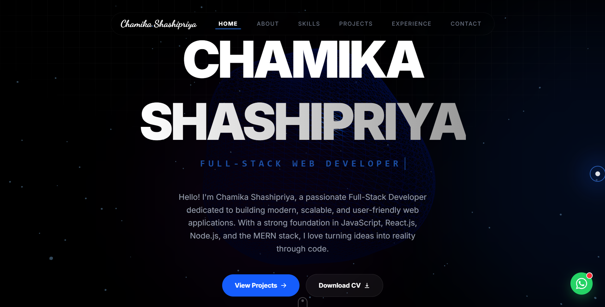
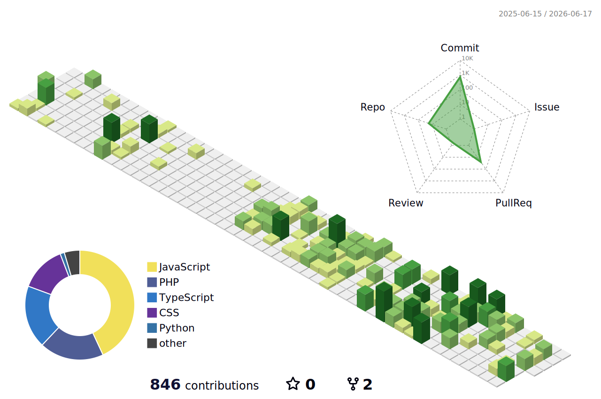

  

<h3 align="center">Web Developer | Sri Lanka</h3>

  A passionate web developer with expertise in building modern, responsive web applications.  
  I specialize in full-stack development and enjoy creating efficient, scalable solutions.

---

<h3 align="center">🚀 Portfolio</h3>

  

  <i>Click the image above to visit my live portfolio! 👆</i>

---

<h3 align="center">🛠️ Skills & Technologies</h3>

  

---

<h3 align="center">📊 GitHub Stats</h3>

  

  <picture>
    <source media="(prefers-color-scheme: dark)" srcset="https://github.com/ChamikaShashipriya99/ChamikaShashipriya99/blob/output/github-contribution-grid-snake-dark.svg?raw=true">
    
  </picture>

  <picture>
    <source media="(prefers-color-scheme: dark)" srcset="profile-3d-contrib/profile-night-view.svg">
    
  </picture>

---

<h3 align="center">📈 Profile Summary Dashboard</h3>

  
  
  
  
  

---

<h3 align="center">🔗 Connect With Me</h3>

  
  
  

