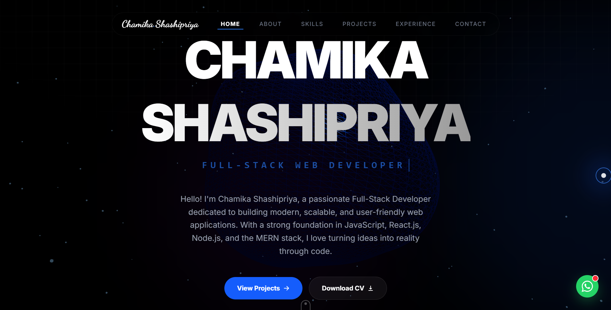
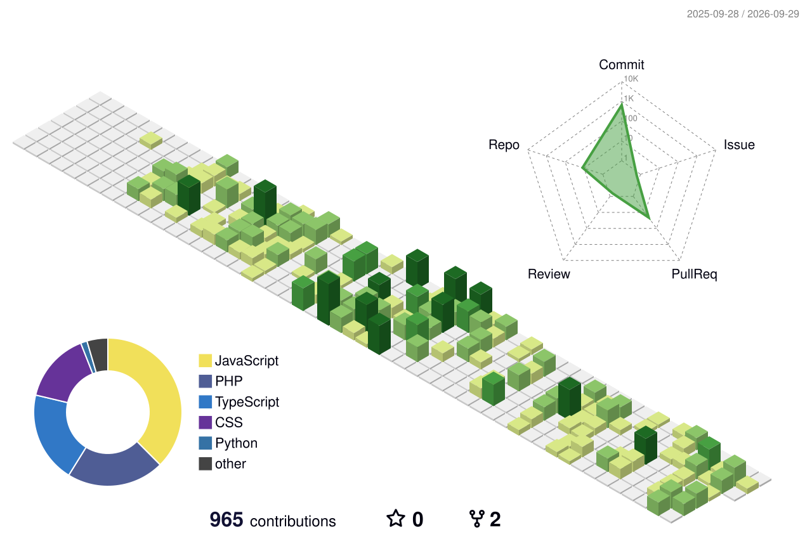
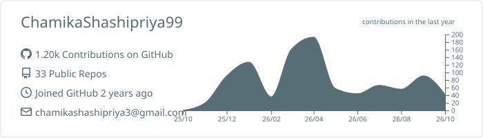
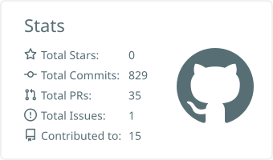

<div align="center">

  <!-- Typing Header -->
  <a href="https://chamikashashipriya.dev" target="_blank">
    
  </a>

  <h3>📍 Full-Stack Web Developer & Software Engineering Undergraduate | Sri Lanka 🇱🇰</h3>

  <!-- Quick Social Badges -->
  <p>
    <a href="https://chamikashashipriya.dev" target="_blank">
      
    </a>
    <a href="https://www.linkedin.com/in/chamika-shashipriya-722366321" target="_blank">
      
    </a>
    <a href="mailto:chamikashashipriya3@gmail.com">
      
    </a>
    <a href="https://www.instagram.com/chamika_99_/" target="_blank">
      
    </a>
  </p>

  <p>
    
  </p>

</div>

---

### 👨‍💻 About Me

```yaml
name: Chamika Shashipriya
role: Full-Stack Web Developer
location: Ambalangoda, Sri Lanka
education: Software Engineering / IT Undergraduate
current_focus: Modern Web Apps • Interactive 3D Web • Scalable Architectures
motto: "🚀 Turning Ideas into Real-World Projects | 🌱 Learn • Build • Improve"
```

- 💡 **Passion:** Crafting high-performance, aesthetically pleasing, and scalable digital solutions.
- 🔭 **Current Work:** Developing full-stack web applications with Next.js, React, Node.js, and Spring Boot.
- 🎨 **Creative Dev:** Exploring 3D web interfaces with Three.js and Framer Motion.
- 📫 **Reach Me:** Feel free to connect via [LinkedIn](https://www.linkedin.com/in/chamika-shashipriya-722366321) or shoot an email to [chamikashashipriya3@gmail.com](mailto:chamikashashipriya3@gmail.com).

---

### 🚀 Featured Live Portfolio

<div align="center">
  <a href="https://chamikashashipriya.dev" target="_blank">
    
  </a>
  <br/>
  <p>
    <b>✨ Futuristic 3D Portfolio built with Next.js, Three.js, and Framer Motion ✨</b><br/>
    👉 <a href="https://chamikashashipriya.dev" target="_blank"><b>Visit chamikashashipriya.dev</b></a> 👈
  </p>
</div>

---

### 🛠️ Tech Stack & Skills

<div align="center">

#### 💻 Programming Languages
<p>
  
</p>

#### 🌐 Frontend Development
<p>
  
</p>

#### ⚙️ Backend & Frameworks
<p>
  
</p>

#### 🗄️ Databases & Tools
<p>
  
</p>

</div>

---

### 🌟 Featured Projects

| Project | Description | Tech Stack | Repository |
| :--- | :--- | :--- | :---: |
| 🌐 **Modern 3D Portfolio** | Futuristic interactive 3D developer portfolio showcasing projects and animations. | `Next.js` `TypeScript` `Three.js` `Tailwind` | [View Repo](https://github.com/ChamikaShashipriya99/My-Portfolio-using-Next.js) |
| 📋 **RP Planner (J26-IT-302)** | Collaborative project and workflow planning tool engineered for research teams. | `C++` `Application` | [View Repo](https://github.com/ChamikaShashipriya99/RP-Planner-J26-IT-302) |
| 🎓 **Smart Campus PAF System** | Scalable enterprise campus management platform built for modern academic workflows. | `JavaScript` `Node.js` `Web` | [View Repo](https://github.com/ChamikaShashipriya99/it3030-paf-2026-smart-campus-group76) |
| 🎪 **Event Management System** | Enterprise event coordination and ticket/attendee handling software system. | `JavaScript` `Full-Stack` | [View Repo](https://github.com/ChamikaShashipriya99/Enterprises-Event-Management-System-ITPM-Group-Project) |
| 🏍️ **Yamaha MT-15 Service Hub** | Dedicated web portal for recording, managing, and monitoring motorcycle maintenance history. | `TypeScript` `React` `Web` | [View Repo](https://github.com/ChamikaShashipriya99/YAMAHA-MT15-Service-Recoard-Holding-WebSite) |
| 🌿 **GreenPulse IoT System** | Intelligent smart environmental monitoring and automation IoT platform. | `C++` `IoT` `Hardware/Cloud` | [View Repo](https://github.com/ChamikaShashipriya99/IOT-Assignment-GraeenPulse) |

---

### 📊 GitHub Activity & Statistics

<div align="center">

  <!-- Streak Stats & Main Stats Cards -->
  <p>
    <a href="https://github.com/ChamikaShashipriya99">
      
    </a>
    <a href="https://github.com/ChamikaShashipriya99">
      
    </a>
  </p>

  <!-- Contribution Snake Animation -->
  <h4>🐍 Contribution Snake</h4>
  <p>
    <picture>
      <source media="(prefers-color-scheme: dark)" srcset="https://raw.githubusercontent.com/ChamikaShashipriya99/ChamikaShashipriya99/output/github-contribution-grid-snake-dark.svg">
      <source media="(prefers-color-scheme: light)" srcset="https://raw.githubusercontent.com/ChamikaShashipriya99/ChamikaShashipriya99/output/github-contribution-grid-snake.svg">
      
    </picture>
  </p>

  <!-- 3D Contribution Graph -->
  <h4>🧊 3D Contribution Graph</h4>
  <p>
    <picture>
      <source media="(prefers-color-scheme: dark)" srcset="profile-3d-contrib/profile-night-view.svg">
      
    </picture>
  </p>

</div>

---

### 📈 Profile Summary Dashboard

<div align="center">
  
  
  <br/>
  
  
</div>

---

<div align="center">
  <h3>🤝 Let's Connect & Collaborate!</h3>
  <p>
    I'm always open to discussing web development projects, creative tech ideas, or open-source opportunities.
  </p>
  <p>
    <a href="https://chamikashashipriya.dev" target="_blank">
      
    </a>
    <a href="https://www.linkedin.com/in/chamika-shashipriya-722366321" target="_blank">
      
    </a>
    <a href="mailto:chamikashashipriya3@gmail.com">
      
    </a>
  </p>
  <sub>⭐ Designed with passion by Chamika Shashipriya ⭐</sub>
</div>
